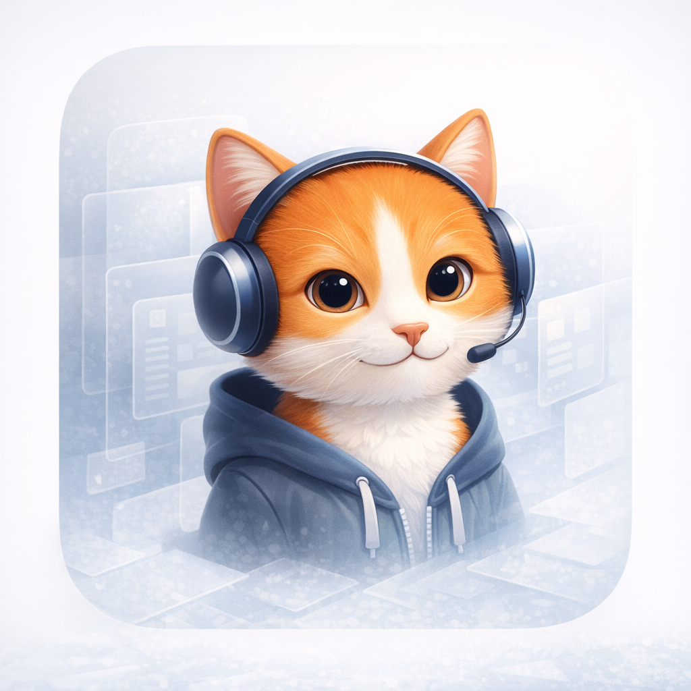
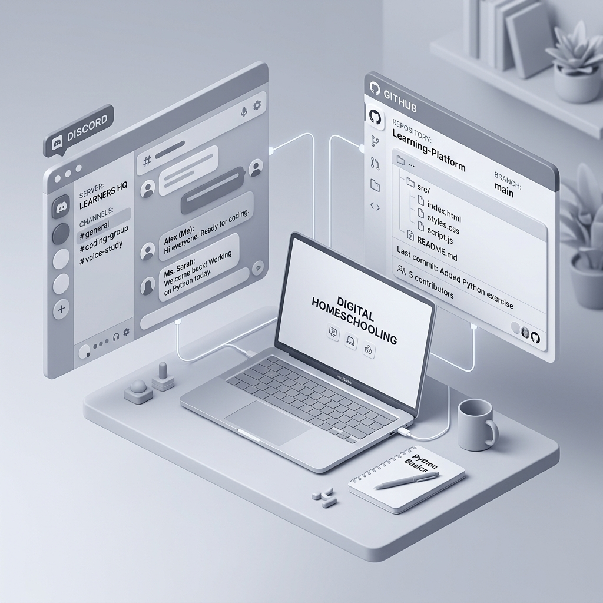
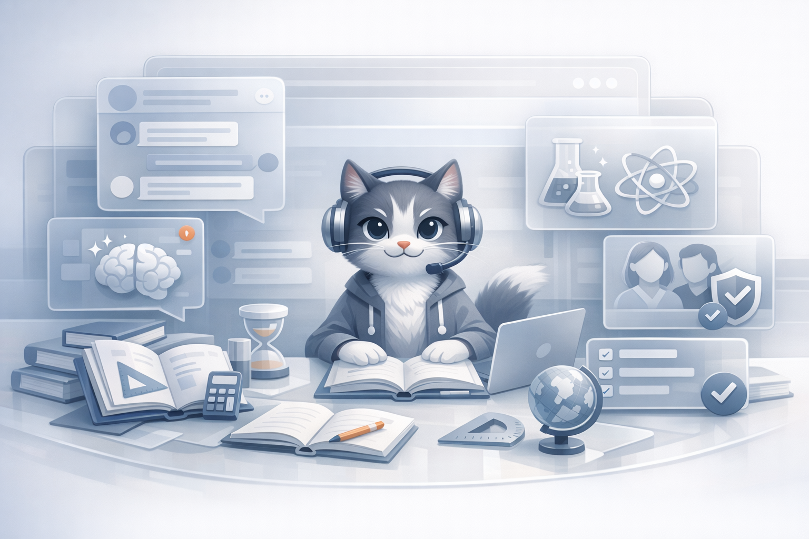

<div align="center">
  
  <h1>OpenTutor</h1>
  <p><strong>A parent-operated collection of tools for homeschooling through GitHub, Discord, and a Claude-backed tutor.</strong></p>
  <p>
    <a href="https://www.python.org/">
      
    </a>
    <a href="https://discordpy.readthedocs.io/">
      
    </a>
    <a href="https://www.anthropic.com/claude">
      
    </a>
    
  </p>
</div>



## Overview

OpenTutor is a parent-operated homeschool model built from open tools rather than closed education software.

- **OpenTutor** is not a single platform. It is a collection of tools used together on purpose.
- **Vibe** is the classroom tutor, teacher assistant, and server admin inside Discord.
- **GitHub** is the record of curriculum, schedules, assignments, and student output.
- **Discord** is the daily classroom interface.
- **Claude** powers the tutoring layer so students can get help without leaving the supervised environment.

This repository currently contains the live tutor layer: the Discord bot, Claude integration, moderation tooling, and the project website / white paper that explains the broader system.

## Why This Project Exists

Most homeschool software hides too much. Curriculum, student work, conversation history, and platform behavior often live inside rented systems that families cannot inspect or shape.

OpenTutor takes the opposite approach:

- curriculum can live in repositories
- daily instruction can happen in channels
- AI help can stay visible and supervised
- student work can accumulate as a real portfolio
- the whole system can improve over time like software

The goal is not to imitate school software. The goal is to create a flexible, reviewable, parent-run learning environment that can become more adaptive, accountable, and capable than conventional school models when used well.

## System Architecture

OpenTutor separates the homeschool stack into three layers while keeping the parent in control of the overall operating model:

1. **The Assignment Hub** — GitHub stores curriculum, schedules, revisions, and student work.
2. **The Virtual Classroom** — Discord provides subject channels, announcements, office hours, and check-ins.
3. **The AI Tutor** — Vibe, backed by Claude, explains concepts, supports teachers, and helps students keep moving.


## Design Rationale


Discord sits at the center of the school day, supported by GitHub structure, tutor assistance, and visible parent oversight.

- **Everything stays reviewable** — Git history shows what changed and when; Discord logs show what happened in the classroom.
- **Help shows up where the work happens** — students can ask for support in the same channel where the assignment and discussion already live.
- **Parents stay in the loop** — the adult remains the operator of the system through roles, channels, moderation tools, and logs.
- **The curriculum can evolve like software** — lessons, reading lists, projects, and pacing can all be versioned and improved.
- **Students practice future workplace tools** — GitHub, Discord, Teams/Slack-style channels, async updates, and repository hygiene become normal early.
- **Professional habits become normal early** — students learn how to ask clear questions, document work, manage revisions, and ship artifacts.

## Repository Model

This bot repo is the first live component. The broader OpenTutor system is designed to expand into a compact repository map:

- **Bot repository** — the Discord tutor, Claude integration, moderation tools, and classroom logic
- **Curriculum repository** — subject outlines, unit plans, reading lists, rubrics, prompts, and project briefs
- **Schedule repository** — weekly rhythm, daily checklists, pacing guides, semester goals, and calendar structure

### Per-Student Structure

Each student can have a dedicated root folder. Inside that folder are subject folders. Inside each subject are assignments, working files, and outputs.

```text
student-name/
  language-arts/
  math/
  stem/
  social-studies/
  projects/
```

### Assignment Workflow

Students learn a concrete digital workflow:

```text
pull assignment
work locally
save progress
commit response
push updated folder back to GitHub
```

This structure also supports long-running project work:

```text
projects/
  coding/
  websites/
  experiments/
  portfolio/
```


## Learning Resources

The white paper now frames this layer as a maintained learning library rather than a fixed curriculum map.

- **For parents** — organize folders like `/math`, `/science`, `/programming`, `/history`, `/reading`, and `/projects`
- **For students** — check the library regularly and do not modify shared resources without permission
- **Quick reference guides** — keep cheat sheets ready for measurements, world facts, finance, science basics, and history
- **Datasets** — store usable CSV and JSON files for coding, research, and project work
- **Essential online tools** — group tools by purpose: productivity, development, AI research, finance, design, and video
- **Teacher + AI workflow** — parents and teachers curate the library, and AI turns it into worksheets, prompts, and review material


## Vibe in the Classroom

Vibe is designed for concise, encouraging, middle-school support inside Discord, while also helping teachers and handling admin tasks safely.

### Core Strengths

- **Classroom-native access** — students just `@mention` Vibe in the channel where they are already working
- **Recent context memory** — Vibe keeps recent message context per channel so follow-up questions remain coherent
- **Role-aware context** — names, roles, and mentions give the tutor better situational awareness
- **Clear explanations** — the bot is tuned for approachable middle-school explanations rather than generic long-form output
- **Teacher assistance** — Vibe can help draft directions, summaries, quizzes, and classroom copy
- **Admin support** — server-changing actions are admin-gated and logged
- **Discord-safe responses** — long outputs are chunked to fit Discord’s limits
- **Parent-visible operation** — moderation and admin actions can be logged for review



## Governance and Safety

The tutor layer only makes sense if parents retain authority over the environment.

- admin-gated moderation tools
- structured subject channels
- `#bot-logs` audit trail for administrative actions
- human-in-the-loop use of Claude
- visible classroom behavior rather than hidden automation

OpenTutor is explicitly parent-operated. The bot supports instruction; it does not replace the parent as the school operator.

## Daily Homeschool Flow

The white paper’s day model is built around a repeatable rhythm:

- **Morning check-in** — review the day’s priorities and channels
- **Guided subject work** — move through assignments with repository-backed materials
- **Tutor support** — ask Vibe for clarification in the active study channel
- **Project time** — build code, websites, research, and portfolio pieces
- **Close and commit back** — commit finished work back into GitHub, log progress, and prepare the next step

That means students are not just consuming lessons. They are learning how to operate inside modern digital workflows.

## Setup Guides

The site now includes direct setup references for the core systems:

- **GitHub accounts** — create parent and student identities with visible ownership
- **Discord classroom setup** — create the homeschool server and subject channels
- **Bot installation** — stand up the Discord bot safely with the right permissions
- **Agentic coding layer** — use Codex-style agents to help draft curriculum, maintain assignments, and accelerate parent feedback while keeping parents as final decision makers

Useful links:

- [Create a GitHub account](https://docs.github.com/en/get-started/start-your-journey/creating-an-account-on-github)
- [GitHub account onboarding](https://docs.github.com/en/get-started/onboarding/getting-started-with-your-github-account)
- [Create a Discord server](https://support.discord.com/hc/en-us/articles/204849977-How-do-I-create-a-server)
- [Discord OAuth2 and installation](https://discord.com/developers/docs/topics/oauth2)
- [Cursor editor](https://cursor.com)
- [Antigravity (VS Code-based)](https://antigravity.google/)
- [OpenAI Codex docs](https://platform.openai.com/docs/codex)


## Features in This Repository

- Claude-backed Discord tutor for homeschool support
- per-channel conversation memory
- `@mention` and DM interaction model
- admin-gated server management actions
- rate limiting and Discord-safe response chunking
- website / white paper explaining the OpenTutor model

## Commands

- `@Vibe [question]` — ask Vibe for help in a server channel
- `!help` — show available help text
- `!reset` — clear recent conversation history for the current channel

## Setup

### Prerequisites

1. Python `3.8+`
2. A Discord application bot from the [Discord Developer Portal](https://discord.com/developers/applications)
3. Discord intents enabled for message content and server members
4. An Anthropic API key from [console.anthropic.com](https://console.anthropic.com/)

### Installation

```bash
git clone https://github.com/murderszn/vibe.git
cd vibe
pip install -r requirements.txt
```

Create a `.env` file in the project root:

```env
DISCORD_TOKEN=your_discord_bot_token_here
ANTHROPIC_API_KEY=your_anthropic_api_key_here
```

Run the bot:

```bash
python3 bot.py
```

### Admin Configuration

Users requesting server-management actions must have a role named `Admin`.

For auditability, create a channel named `bot-logs` so Vibe can report moderation and administrative actions there.

## Website / White Paper

This repository also includes the OpenTutor white-paper site in `site/index.html`.

Open the site locally with any static file server, for example:

```bash
python3 -m http.server 8000
```

Then visit `http://localhost:8000`.

## Status

- **Live now** — bot repository
- **Planned next** — curriculum repository
- **Planned next** — schedule repository

## Author

Published and maintained by [@murderszn](https://github.com/murderszn).

## Footer Summary

OpenTutor is a parent-operated homeschool model built around GitHub, Discord, and a Claude-backed tutor layer, with visible systems, clear ownership, and durable student work.
